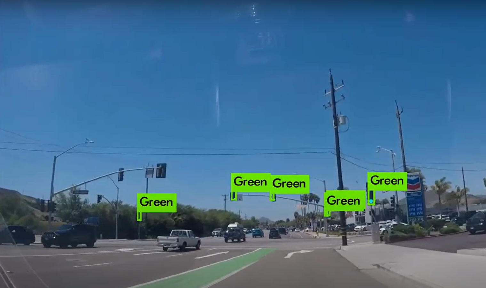

# BOSCH Traffic Sign Detection using YOLOv3

Traffic Sign Detection on Bosch Small Traffic Sign Detection dataset using Yolov3-tiny trained on Jetson Xavier

## Bosch Small Traffic Sign Dataset

This dataset contains 13427 camera images at a resolution of 1280x720 pixels and contains about 24000 annotated traffic lights. The annotations include bounding boxes of traffic lights as well as the current state (active light) of each traffic light.
The camera images are provided as raw 12bit HDR images taken with a red-clear-clear-blue filter and as reconstructed 8-bit RGB color images. The RGB images are provided for debugging and can also be used for training. However, the RGB conversion process has some drawbacks. Some of the converted images may contain artifacts and the color distribution may seem unusual.

Dataset specifications:
Training set:
- 5093 images
- Annotated about every 2 seconds
- 10756 annotated traffic lights
- Median traffic lights width: ~8.6 pixels
- 15 different labels
- 170 lights are partially occluded

Test set:
- 8334 consecutive images
- Annotated at about 15 fps
- 13486 annotated traffic lights
- Median traffic light width: 8.5 pixels
- 4 labels (red, yellow, green, off)
- 2088 lights are partially occluded

Reference from [Bosch Small Traffic Light Dataset](https://hci.iwr.uni-heidelberg.de/content/bosch-small-traffic-lights-dataset)

## Dependencies and Dataset

This repository requires the following dependencies and dataset
- Python3
- [Bosch Small Traffic Light Dataset](https://hci.iwr.uni-heidelberg.de/content/bosch-small-traffic-lights-dataset) - Download all the training .rgb files. Use 7-zip to extract. Make sure you download all the training files before extracting. Details for extracting is given [here](https://hiro.bsd.uchicago.edu/node/3168).
- [Yolov3](https://github.com/pjreddie/darknet)


## Understanding the dataset

After being unzipped, all the image files will reside in multiple folders. Copy or move all the images from different folders to one single folder as it get's easy to manipulate. The images contains the frame at 10th second in the corresponding video.

Create a new folder under ```rgb/train``` and rename it as ```rgb/train/traffic_light_images```.  

## Steps to build

1. Download the dataset and unzip the image. Create a new folder and copy all the images there as mentioned above.  
2. Clone the Yolov3 darknet repository. Configure the Makefile to enable training it on GPU.
 ```
 git clone https://github.com/pjreddie/darknet.git
 cd darknet
 make
 ```
3. We need to convert the train.yaml to VOC format because we have a script which will convert the VOC format to YOLO format. Create another folder ```traffic_light_xmls``` in the main directory and use the python script present in the ```utils/bosch_to_pascal.py```.
  - ``` python bosch_to_pascal.py ../train.yaml ../rgb/train/traffic_light_xmls/```

4. Now, we need a .txt file which will contain all the path of the .xmls generated. We need this to convert the labels from VOC pascal format to YOLO format.
5. Use the python script ```utils/xml_list_generator```, which will generate an output .txt file. Run the following command
  - ```python xml_list_generator.py PATH_TO_DATASET/rgb/train/traffic_light_xmls/```

6. Now, create a folder to store the YOLO labels. Use the script ```utils/voc_to_yolo_bosch.py``` which will generate labels in the YOLO format.
  - ```python voc_to_yolo_bosch.py PATH_TO_DATASET/rgb/train/traffic_light_labels ../<xml_list generated> PATH_TO_DATASET/rgb/train/traffic_light_images```

7. We need two files "train.txt" and "test.txt" which are basically the image's path. Use the script ```utils/image_list_generator.py``` to convert the image into a single .txt file.
  - ```python image_list_generator.py PATH_TO_DATASET/rgb/train/traffic_light_images/```

8. Split of the image .txt file into test and train needs to be done. Use the script ```utils/train_test_split.py``` to convert it into two seperate .txt file based on the percentage.
  - ```python train_test_split.py <name of image_txt file> 0.2```

9. It's time to copy everything into darknet folder we cloned earlier. First copy the bosch.data and bosch.names from the \data folder to a new folder (traffic_lights) in the darknet yolov3 main folder.
  ```
  cd darknet
  mkdir traffic_lights
  ```
10. Copy the yolov3-tiny-bosch.cfg from the \config folder to the same (traffic_lights) folder. Finally make sure you have the following files in the traffic_lights folder.
  - train.txt
  - test.txt
  - bosch.data
  - bosch.names
  - yolov3-tiny-bosch.cfg
  - backup folder which stores the weights

11. Download the yolov3 imagenet darknet53 [weights](https://pjreddie.com/darknet/yolo/)
12. Run the following on terminal for training the model
  ```
  cd darknet
  ./darknet detector train traffic_lights/bosch.data traffic_lights/yolov3-tiny-bosch.cfg darknet53.conv.74
  ```

## Test the model performance

The yolov3 trained weights can be used to see the performance by running the following command on terminal.
```
cd darknet
./darknet detector demo traffic_lights/bosch.data traffic_lights/yolov3-tiny-bosch.cfg traffic_lights/backup/<weight_file> <video file>
```

## Final Output


